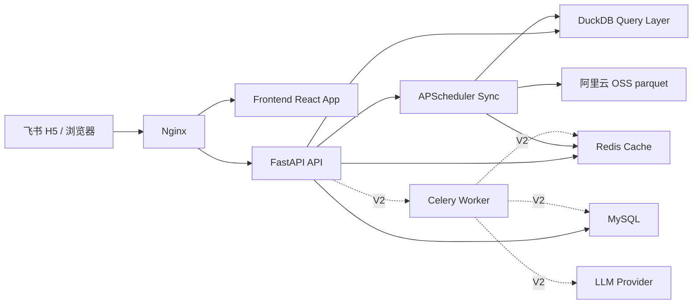

# Apex 整体技术架构实现方案

## 1. 目标与设计原则

本文基于以下输入统一整理：

- `需求/04_后端架构沟通.png` 中 Sonnet 已讨论的后端分层、缓存、AI 异步扩展思路
- `需求/Apex早期靶点情报分析智能体PRD.docx` 中 V1 业务范围、查询规则、性能要求
- 当前仓库的数据现状：`ci_tracking_info` 约 277MB，为 V1 核心分析主表

本方案的目标不是做一套“未来感很强但落不了地”的平台，而是先保证 V1 可以稳定上线，再为 V2 的 AI 分析能力预留低成本演进路径。

核心原则：

1. 查询优先，不先做重仓数据平台
2. 结构化分析优先，不把 AI 当成主查询引擎
3. 本地列式计算优先，先用 DuckDB 吃透 parquet
4. 高并发靠缓存，不靠数据库硬扛
5. V1 和 V2 解耦，AI 能力通过异步任务叠加

## 2. 业务范围拆分

### 2.1 V1 必做

- 飞书 H5 单点登录
- 疾病树筛选
- 靶点组合竞争矩阵
- 靶点研发进展泳道图
- 当前筛选结果导出 Excel
- 每日 05:00 后的数据自动同步、热切换、缓存失效

### 2.2 V2 预留

- 基于当前筛选结果的一键 AI 分析
- AI 历史分析记录
- 结果可追溯到具体数据版本
- 后续接入更多非结构化证据源时再引入检索增强

### 2.3 数据源定位

- `pharmcube2harbour_ci_tracking_info_0.parquet`
  - V1 主事实表
  - 支撑疾病树、靶点、矩阵、泳道图、tooltip、导出
- `pharmcube2harbour_clinical_trial_detail_info_0.parquet`
  - V1 可不进入主链路
  - 作为 V1.1 / V2 详情页与 AI 引证增强的数据源
- `pharmcube2harbour_drug_pipeline_info_0.parquet`
  - 暂不作为当前智能体主查询引擎
  - 为后续管线视图、公司/适应症分析预留

## 3. 推荐技术选型

| 层 | 选型 | 原因 |
|---|---|---|
| 前端 | React + TypeScript + Vite | 迭代快，适合内部平台 |
| 状态管理 | Zustand | 比 Redux 更轻，足够支撑筛选与视图状态 |
| 服务端请求 | TanStack Query | 缓存、轮询、错误恢复适合查询型系统 |
| UI 组件 | Ant Design | Tree/Table/Tooltip/Dropdown 成熟 |
| 后端 API | FastAPI | 类型清晰、开发效率高、易拆模块 |
| 查询引擎 | DuckDB | 直接读 parquet，适合当前 277MB 主表 |
| 业务库 | MySQL 8 | 用户、日志、版本、任务元数据 |
| 缓存 | Redis | 扛查询并发，支撑导出与 AI 任务状态 |
| 定时任务 | APScheduler | V1 足够，随 FastAPI 启动即可 |
| AI 异步任务 | Celery + Redis Broker | V2 叠加最平滑 |
| 网关 | Nginx | 静态资源、反向代理、SSL、压缩 |
| 部署 | Docker Compose | 当前阶段最合适，后续可迁 K8s |

不建议当前就上 ClickHouse、Kafka、向量库。原因很简单：当前核心问题不是超大规模，而是“规则复杂 + 查询快 + 架构别过度”。

## 4. 总体架构



## 5. 后端分层设计

后端采用“接入层 + 业务层 + 任务层 + 数据层 + AI 扩展层”的五层结构。

### 5.1 接入层

- `Nginx`
  - 托管前端静态资源
  - 反向代理 `/api/*`
  - 处理 HTTPS、gzip、访问日志
- `FastAPI`
  - 对外唯一业务 API
  - 统一鉴权、参数校验、错误码、响应结构

### 5.2 业务层

建议拆成以下 router + service 模式：

- `routers/auth.py`
- `routers/system.py`
- `routers/meta.py`
- `routers/matrix.py`
- `routers/pipeline.py`
- `routers/export.py`
- `routers/ai.py`（V2 开启）

对应 service：

- `services/feishu_auth.py`
- `services/data_version.py`
- `services/meta_query.py`
- `services/matrix_query.py`
- `services/pipeline_query.py`
- `services/export_service.py`
- `services/ai_task_service.py`（V2）

### 5.3 任务层

- `APScheduler`
  - 每日 05:10 拉取 OSS 最新 parquet
  - 本地落盘到 `data/raw/<yyyymmdd>/`
  - 校验完成后原子切换 DuckDB 视图
  - 写入 `data_versions` / `sync_jobs`
  - 清理 Redis 查询缓存
- `Celery Worker`（V2）
  - 执行 AI 分析任务
  - 避免用户同步等待 5 到 30 秒

### 5.4 数据层

- `DuckDB`
  - 负责 parquet 的主查询和聚合
  - 只承接分析型查询，不承接用户元数据
- `Redis`
  - 缓存矩阵、tooltip、泳道图查询结果
  - 也可在 V2 作为 Celery broker + 任务结果临时存储
- `MySQL`
  - 用户、数据版本、同步日志、导出记录、AI 任务记录

### 5.5 AI 扩展层

V1 不把 AI 放在主链路里。V2 新增 `/api/ai/*` 与 `Celery Worker`，让 AI 基于结构化结果做总结，而不是直接对原始 parquet 进行开放式问答。

## 6. 目录结构建议

```text
apex/
├── frontend/
│   ├── src/
│   │   ├── pages/
│   │   ├── modules/
│   │   ├── components/
│   │   ├── hooks/
│   │   ├── stores/
│   │   ├── services/
│   │   └── types/
├── backend/
│   ├── app/
│   │   ├── main.py
│   │   ├── core/
│   │   │   ├── config.py
│   │   │   ├── logging.py
│   │   │   ├── auth.py
│   │   │   ├── duckdb_conn.py
│   │   │   ├── redis_client.py
│   │   │   └── mysql.py
│   │   ├── routers/
│   │   ├── services/
│   │   ├── repositories/
│   │   ├── models/
│   │   ├── schemas/
│   │   ├── tasks/
│   │   └── utils/
│   ├── tests/
│   └── alembic/
├── data/
│   ├── raw/
│   ├── cache/
│   └── exports/
└── deploy/
    ├── docker-compose.yml
    └── nginx/
```

## 7. 核心数据架构设计

### 7.1 查询主表

V1 统一把 `ci_tracking_info` 视为主事实表，原因：

- 已包含疾病、治疗领域、靶点、药物、机构、阶段、试验号、日期
- 已能覆盖 PRD 中矩阵和泳道图全部主能力
- 少做跨表关联，降低首版复杂度

### 7.2 DuckDB 视图层

建议启动时创建三类逻辑视图，而不是把复杂 SQL 写散在接口里。

#### 视图一：`latest_records`

严格实现 PRD 的“最新记录”规则：

1. `nct_id = highest_trial_id` 且二者非空
2. 不存在上述命中记录时，保留 `nct_id` 为空的记录

不要偷懒只看一个布尔字段，否则矩阵和泳道图会错。

#### 视图二：`stage_mapped_records`

在 DuckDB 中统一完成阶段映射：

| 原值 | score | 矩阵显示 | 泳道图显示 |
|---|---:|---|---|
| 临床前 | 0.1 | PreClinical | PreC |
| 申报临床 | 0.5 | IND | IND |
| I期临床 | 1.0 | Phase I | Phase 1 |
| I/II期临床 | 1.5 | Phase I/II | Phase 1 |
| II期临床 | 2.0 | Phase II | Phase 2 |
| II/III期临床 | 2.5 | Phase II/III | Phase 2 |
| III期临床 | 3.0 | Phase III | Phase 3 |
| 申请上市 | 3.5 | BLA | BLA |
| 批准上市 | 4.0 | Approved | Market |

#### 视图三：`normalized_target_records`

对 `targets` 做统一归一化：

- 拆分多靶点字符串
- 去除空格差异
- 排序后再拼接，得到 `norm_targets`
- 保留 `target_count`
- 单靶点和组合靶点共用一套基础数据

这样矩阵查询、tooltip、泳道图、导出都能共用一个规范化结果集。

### 7.3 MySQL 元数据表

建议首版建这些表：

#### `users`

- `id`
- `open_id`
- `name`
- `email`
- `avatar_url`
- `last_login_at`
- `created_at`
- `updated_at`

#### `data_versions`

- `id`
- `source_name`
- `file_name`
- `file_etag`
- `file_size`
- `version_date`
- `loaded_at`
- `is_active`

#### `sync_jobs`

- `id`
- `job_type`
- `status`
- `started_at`
- `finished_at`
- `message`
- `version_id`

#### `query_logs`

- `id`
- `user_id`
- `query_type`
- `params_json`
- `response_ms`
- `cache_hit`
- `created_at`

#### `export_jobs`

- `id`
- `user_id`
- `export_type`
- `params_json`
- `file_path`
- `status`
- `created_at`

#### `ai_tasks`（V2）

- `id`
- `task_id`
- `user_id`
- `task_type`
- `params_json`
- `data_version_id`
- `status`
- `provider`
- `model`
- `result_text`
- `error_message`
- `created_at`
- `completed_at`

### 7.4 Redis 缓存键设计

所有业务查询缓存统一使用 `apex:` 命名空间前缀：

- `apex:matrix:{md5(params)}`
- `apex:matrix_tooltip:{md5(params)}`
- `apex:pipeline:{md5(params)}`
- `ai_task:{task_id}`（V2，不在批量失效范围内）

策略：

- TTL 默认 1 小时
- 同步任务成功后通过 `cache_flush_pattern("apex:*")` 批量失效，命名空间需与 key 生成规则保持一致
- `meta` 类接口不必强制缓存，DuckDB 直查即可

## 8. 关键后端接口设计

### 8.1 鉴权与系统接口

- `POST /api/auth/feishu/code2token`（飞书 JSSDK 静默获取 code 后调用，换取 JWT）
- `GET /api/auth/me`（验证 JWT，返回当前用户信息）
- `POST /api/auth/mock-login`（仅 DEBUG=true，本地开发用）
- `GET /api/system/sync-status`

### 8.2 元数据接口

- `GET /api/meta/disease-tree`
  - 返回两级树：`ta -> diseases`
- `GET /api/meta/targets?disease=xxx`
  - 返回指定疾病下的靶点列表和字母分组
- `GET /api/meta/stages`
  - 返回阶段枚举、score、显示名称

### 8.3 矩阵接口

- `POST /api/matrix/query`
- `POST /api/matrix/tooltip`
- `GET /api/matrix/export`

`/api/matrix/query` 返回建议：

- `targets`
- `single_max`
- `cells`
- `legend`
- `data_version`

### 8.4 泳道图接口

- `POST /api/pipeline/query`
- `GET /api/pipeline/export`

### 8.5 AI 接口（V2）

- `POST /api/ai/analyze/matrix`
- `GET /api/ai/result/{task_id}`
- `GET /api/ai/history`

## 9. 关键查询实现思路

### 9.1 疾病树

直接从 `latest_records` 中聚合：

- `SELECT ta, harbour_indication_name`
- 后端组装成树
- 默认按 `ta`、`disease` 排序

### 9.2 矩阵查询

步骤：

1. 用筛选条件过滤疾病与阶段
2. 取单靶点的最高阶段分值，生成 `single_max`
3. 取多靶点组合的最高阶段分值与药物数
4. 汇总全部涉及靶点，按“分值降序 + ASCII 升序”排序
5. 返回前端渲染矩阵

注意：

- 组合关系不是简单字符串包含，要依赖规范化后的 `norm_targets`
- 单靶点分值和组合分值都必须从同一批最新记录中求得

### 9.3 Tooltip 查询

按 `(row_target, col_target, disease filters)` 过滤明细，返回：

- 药物英文名
- 原研机构
- 所有研究机构
- 最高阶段日期
- `nct_id`

### 9.4 泳道图查询

步骤：

1. 限定单疾病
2. 将选中靶点映射到记录集
3. 把阶段合并到 7 个固定泳道列
4. 每格返回药品列表

这里必须在服务层显式合并：

- `1.0 + 1.5 -> Phase 1`
- `2.0 + 2.5 -> Phase 2`

### 9.5 Excel 导出

导出不复用前端表格，而是由后端直接输出结构化明细：

- 当前筛选条件
- 数据版本
- 原始字段
- 映射字段
- 导出时间

建议用 `openpyxl` 或 `xlsxwriter`，避免前端拼 Excel。

## 10. 数据同步与热更新

同步流程建议：


关键实现细节：

- 先下载到临时目录，校验通过后再 rename
- DuckDB 采用"全局单例连接 + 每请求独立 cursor"模式：`get_cursor()` 返回 `_conn.cursor()`，执行上下文隔离，线程安全；`reload_conn()` 加锁重建连接后旧 cursor 自动失效
- 每次同步必须记录版本号和异常日志
- 失败时保留旧版本继续服务

## 11. AI 智能体扩展方案

### 11.1 V1 的态度

PRD 明确 V1 不做“AI 自动分析报告”。因此 V1 只保留扩展点，不进入主路径，不影响上线范围。

### 11.2 V2 的正确做法

AI 不直接读原始 parquet，也不开放自由聊天。建议先做“结构化分析助手”：

1. 前端把当前筛选条件提交给 `/api/ai/analyze/matrix`
2. FastAPI 只负责创建任务并立即返回 `task_id`
3. Celery Worker 查询结构化矩阵明细
4. Prompt Builder 拼装结构化上下文
5. 调用 LLM 生成结论、风险、机会点
6. 结果落 Redis + MySQL
7. 前端轮询展示

### 11.3 为什么先不做向量库

当前核心输入是结构化字段，不是海量长文本知识库。矩阵、泳道图和竞争分析本质上是 SQL 问题，不是检索问题。

只有在这些场景再考虑加向量检索：

- 接入全文论文、会议摘要、新闻、专利
- 需要做证据引用和多文档总结
- 需要基于非结构化文本做跨源问答

那时再引入：

- 对象存储 + 文本清洗
- 分块索引
- 向量库
- rerank
- 引证输出

### 11.4 AI 模块内部拆分

- `prompt_builder`
- `analysis_runner`
- `provider_client`
- `result_formatter`
- `task_repository`

这样后续可以切换 Anthropic / OpenAI，而不影响业务接口。

## 12. 性能与容量判断

基于当前数据规模：

- `ci_tracking_info` 约 277MB
- `clinical_trial_detail_info` 约 117MB
- 当前数据量对 DuckDB 完全可接受

真正风险不在容量，而在并发与缓存命中率。

建议性能目标：

- `meta` 查询 < 200ms
- 矩阵首查 < 1500ms
- 矩阵缓存命中 < 80ms
- 泳道图首查 < 1000ms
- 导出 < 10s
- 支撑 100 并发，依赖 Redis 缓存

## 13. 安全、审计与可观测性

### 13.1 安全

- JWT 鉴权
- 仅允许飞书企业身份进入
- `.env` 管理飞书和数据库密钥
- 导出接口校验用户身份

### 13.2 审计

- 登录记录
- 查询日志
- 导出日志
- 数据同步日志
- AI 调用日志（V2）

### 13.3 可观测性

- 应用日志统一 JSON
- 记录 `request_id`
- Prometheus 指标可作为后续增强
- 首版至少输出：
  - 接口耗时
  - Redis 命中率
  - DuckDB 查询耗时
  - 同步任务成功率

## 14. 部署方案

V1 推荐 4 容器：

1. `backend`
2. `mysql`
3. `redis`
4. `nginx`

V2 增加：

5. `celery_worker`
6. `flower`（可选）

部署方式：

- 单台阿里云 ECS 起 Docker Compose
- `backend` 挂载 `data/`
- 定时同步后本地读取 parquet
- Nginx 同机代理前后端

## 15. 实施优先级

### 第一期

1. 后端骨架 + 配置管理 + 健康检查
2. 飞书登录 + mock login
3. DuckDB 读 parquet + latest/stage/normalized 视图
4. disease-tree / targets / stages
5. matrix query / tooltip + Redis
6. pipeline query
7. export
8. APScheduler 同步与热加载
9. Docker Compose 联调

### 第二期

1. query_logs / data_versions 完整化
2. AI 异步任务链路
3. AI 历史记录
4. 详情页引用 `clinical_trial_detail_info`

## 16. 最终结论

最优解不是“大而全平台”，而是分两步：

- V1：`FastAPI + DuckDB + Redis + MySQL + APScheduler + Nginx`
- V2：在 V1 不改主链路的前提下，新增 `Celery + LLM Provider`

这套方案和 Sonnet 的方向一致，但补齐了几个关键落地点：

- 明确以 `ci_tracking_info` 为 V1 主事实表
- 明确把“最新记录、阶段映射、靶点归一化”固化为 DuckDB 视图层
- 明确 Redis 是并发解法，不是附属优化
- 明确 AI 只做异步叠加，不侵入 V1 查询链路
- 明确数据版本、同步日志、查询日志是上线后可维护性的基础

如果按这个方案推进，后端可以先把查询和同步链路做扎实，前端随后接矩阵与泳道图，整体风险最低。
