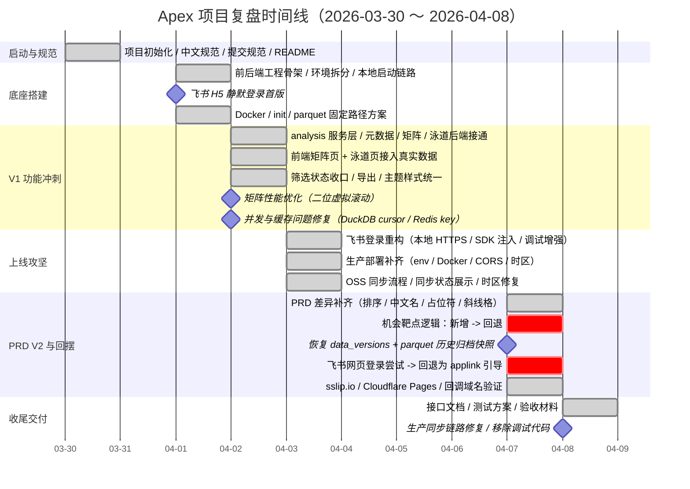

# Apex 项目复盘

> 复盘时间范围：`2026-03-30` 至 `2026-04-08`
>
> 依据：仓库 `git log`、`AGENTS.md`、`README.md`、架构文档、需求文档与当前代码状态整理。

## 1. 一图总览

可编辑源文件：

- [apex项目复盘图.svg](/Users/adam/repo/Apex/架构/apex项目复盘图.svg)

## 2. Mermaid 时间线

## 3. 总结概览

Apex 在不到两周的有效开发窗口内，完成了从项目初始化到 V1 可交付雏形的搭建。整体推进节奏非常集中，核心路径可以概括为：

1. 先统一协作规则与技术边界
2. 再快速搭出前后端底座和登录链路
3. 随后在一天内完成矩阵、泳道两大核心分析页面闭环
4. 最后把飞书登录、OSS 同步、部署配置、版本追溯这些真实上线问题逐步收口

从项目性质上看，Apex 并不是一个通用 BI 项目，而是围绕 Harbour 内部药物研发分析场景，基于 parquet + DuckDB 的结构化分析平台。V1 重点不是“功能越多越好”，而是把查询、筛选、导出、登录、同步、追溯这些关键链路先打稳。

## 4. 分阶段复盘

### 4.1 启动与规范阶段（`2026-03-30`）

这一阶段主要完成项目初始化、中文化规范、提交规范、README 和自动提交流程的约束。说明当时优先级不是写业务代码，而是先把协作方式、提交习惯和文档入口统一，降低后续快速迭代时的摩擦成本。

阶段结论：

- 决定使用中文作为 UI 和提交描述语言
- 明确 Commitlint 规范和自动提交工作流
- 为后续高频迭代打下统一协作基础

### 4.2 底座搭建阶段（`2026-04-01`）

这一阶段完成了前后端工程骨架、环境变量拆分、本地与 Docker 启动流程、初始化脚本，以及飞书 H5 静默登录首版。此时系统从“空仓库”进入“能启动、能登录、能联调”的状态。

阶段结论：

- FastAPI + React 工程结构成型
- 本地和容器化启动链路可用
- 飞书 H5 静默登录首版打通
- parquet 存储策略先采用固定路径覆盖写入，优先追求简单

### 4.3 V1 核心功能冲刺阶段（`2026-04-02`）

这是整个项目最关键的一天。后端完成 analysis 服务层接入，前端矩阵页、泳道页接入真实数据，筛选状态被统一收口到 Zustand，同时补齐导出能力和视觉主题。矩阵性能和并发缓存问题也在这一天暴露并修复。

阶段结论：

- 竞争矩阵和研发泳道正式可用
- 筛选、tooltip、导出、样式形成闭环
- `DuckDB` cursor 隔离和 `Redis` key 命名空间问题被修复
- 矩阵页因真实数据量触发性能瓶颈，最终通过二维虚拟滚动解决

### 4.4 上线链路攻坚阶段（`2026-04-03`）

在核心页面可用之后，主要问题转移到真实运行环境。飞书登录为适配本地 HTTPS 调试和容器场景进行了重构；同时补齐生产环境变量、Docker 构建、时区、CORS 和 OSS 同步状态链路。

阶段结论：

- 飞书登录从“能用”进入“能调试、能部署”
- Docker、env、时区、镜像源等部署链路补齐
- OSS 同步与前端同步状态展示完成闭环

### 4.5 PRD V2 与回摆阶段（`2026-04-07`）

这是变更最密集、最能体现真实项目特征的一天。一方面补齐了 PRD 差异，另一方面出现了明显的方向回摆，例如机会靶点逻辑先加后撤、网页登录 OAuth 尝试后又回退为 applink 引导。与此同时，为了满足版本追溯需求，又恢复了 `data_versions` 和 parquet 历史归档。

阶段结论：

- 项目从“做功能”切换到“对齐 PRD 和真实场景”
- 飞书外部浏览器方案最终收敛为“引导回飞书客户端”
- 数据版本策略从“固定覆盖”回摆到“保留历史快照”

### 4.6 收尾交付阶段（`2026-04-08`）

这一阶段以交付材料和生产收尾为主，包括接口文档、测试方案、验收报告、生产同步配置修复，以及移除前端调试代码。说明项目已进入“可讲述、可验收、可交接”的状态。

阶段结论：

- 文档体系开始完整
- 生产同步链路进一步稳定
- 项目具备对外汇报与内部验收条件

## 5. 关键里程碑

- `M1` `2026-04-01`：飞书 H5 静默登录首版打通
- `M2` `2026-04-02`：竞争矩阵与研发泳道接入真实数据，V1 核心分析能力成型
- `M3` `2026-04-02`：并发与缓存问题收口，矩阵性能方案落定
- `M4` `2026-04-07`：恢复 `data_versions` 与 parquet 历史归档，支持数据版本追溯
- `M5` `2026-04-08`：补齐接口、测试、验收材料，进入交付态

## 6. 重点环节

### 6.1 核心业务环节

- 以 `ci_tracking_info` 为 V1 主事实表，优先支撑疾病树、矩阵、泳道、导出
- 前端以 React + Zustand + React Query 组织筛选与查询型页面
- 后端以 FastAPI + DuckDB + Redis 形成查询与缓存主链路

### 6.2 上线稳定性环节

- 飞书登录链路
- OSS parquet 同步与热更新
- Redis 缓存失效
- Docker / CORS / 域名 / 时区配置

### 6.3 追溯与扩展环节

- 恢复 `data_versions` 表
- 增加 parquet 历史归档目录
- 为 PRD V2 的历史事件视图和后续 AI 分析预留基础

## 7. 来回反复的坑点

### 7.1 飞书登录方案反复最多

实际推进路径大致是：

- 先完成 H5 静默登录首版
- 再为本地 HTTPS、SDK 注入、调试信息增强进行重构
- 后续尝试外部浏览器网页 OAuth
- 最终回退为 applink 引导，要求用户回到飞书客户端访问

这说明真正复杂的不是 JWT，而是飞书容器识别、回调域名、访问场景和平台限制。

### 7.2 parquet 版本策略发生反转

项目早期为了简化链路，先把版本化目录去掉，改为固定路径覆盖写入。随着 PRD V2 对历史事件和版本追溯的要求出现，又恢复 `data_versions` 与 parquet 历史归档，并补上“同天重复同步不重复归档、仅保留最近 5 天”的规则。

### 7.3 矩阵性能问题是被真实数据逼出来的

竞争矩阵在真实靶点规模下出现明显渲染压力，最终通过二维虚拟滚动解决。这意味着性能优化不是预防性工作，而是业务真实落地后的必经环节。

### 7.4 环境问题高度集中在部署侧

集中踩到的问题包括：

- `ALLOWED_ORIGINS` 解析
- 主域名与回调域名切换
- Cloudflare Pages 客户端路由支持
- Docker 构建时 Node 堆内存不足
- 统一 `Asia/Shanghai` 时区
- 生产同步配置链路不一致

## 8. 重点信息沉淀

当前项目内已经沉淀出的关键资料主要有：

- [AGENTS.md](/Users/adam/repo/Apex/AGENTS.md)
- [README.md](/Users/adam/repo/Apex/README.md)
- [Apex整体技术架构实现方案.md](/Users/adam/repo/Apex/架构/Apex整体技术架构实现方案.md)
- [飞书登录流程.md](/Users/adam/repo/Apex/架构/飞书登录流程.md)
- [OSS数据同步流程.md](/Users/adam/repo/Apex/架构/OSS数据同步流程.md)
- [API接口文档.md](/Users/adam/repo/Apex/架构/API接口文档.md)

这些文档共同完成了从“需求说明”到“技术方案”再到“接口与交付”的信息闭环。

## 9. 当前项目状态判断

截至 `2026-04-08`，Apex 已经完成以下核心能力：

- V1 前后端基础架构
- 飞书登录主链路
- 竞争矩阵页面
- 研发泳道页面
- 元数据查询、导出、同步状态展示
- OSS 定时同步与 parquet 热更新
- 数据版本与历史归档基础能力

仍待完成的主要内容包括：

- 数据总览 Dashboard
- 竞争格局页面
- 导出任务管理正式实现
- 更系统的联调与测试补强

## 10. 一句话结论

Apex 的核心历程不是“做了多少页面”，而是用极短时间把药物研发分析平台的关键基础链路搭起来，并在飞书登录、数据同步、版本追溯和生产部署这几条最容易出问题的路径上完成了多轮修正与收敛，最终形成了一个可继续迭代、也具备交付表达能力的 V1 雏形。
