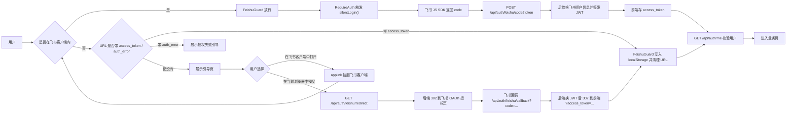
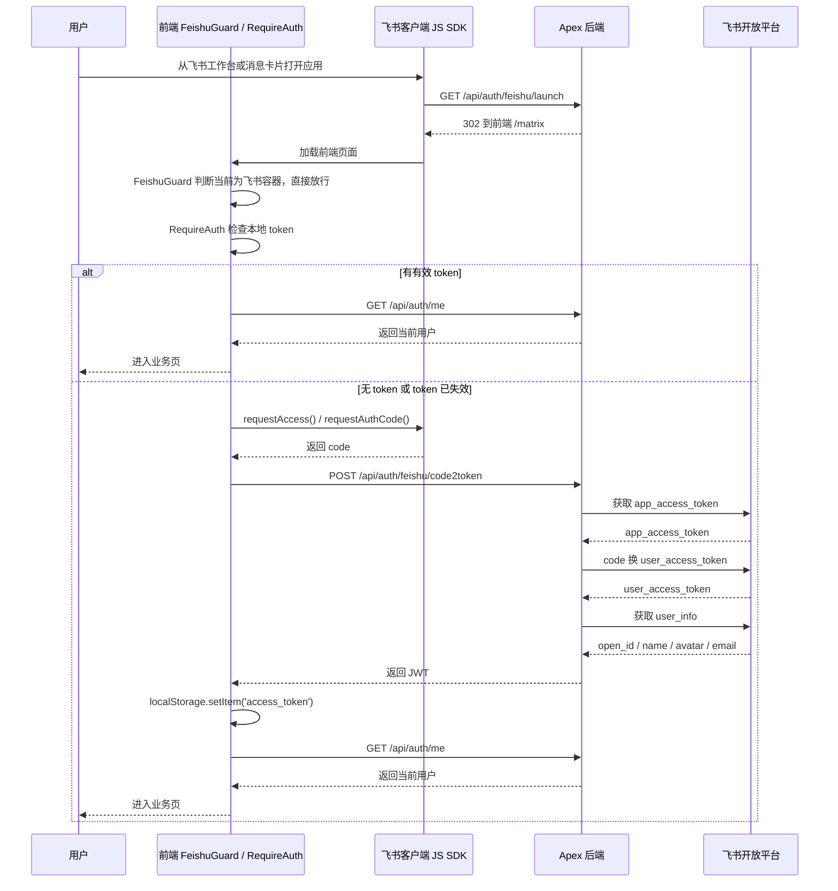
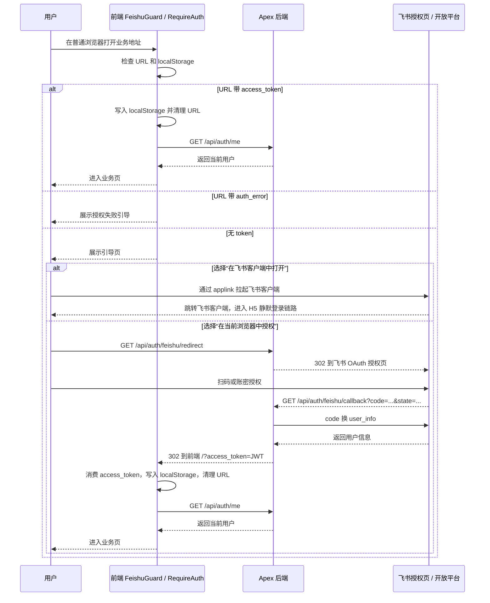

# 飞书登录流程

Apex 支持两种访问场景，共用同一套后端鉴权体系（JWT）。

本文中的流程图使用 Mermaid 语法：

- 总链路使用 `flowchart`
- 前端 / 后端 / 飞书三端交互使用 `sequenceDiagram`

---

## 登录总览



---

## 场景一：飞书客户端内（H5 静默登录）

用户从飞书工作台或消息卡片点击进入，飞书 JSSDK 静默获取临时 code，POST 给后端换 JWT，全程用户无感知。

### 前置配置（飞书开放平台）

| 配置项 | 值 |
|--------|-----|
| 应用类型 | 企业自建应用 |
| 功能 | 网页应用（H5） |
| 网页 URL（入口） | `https://your-domain.com/api/auth/feishu/launch` |
| 可信域名 | `your-domain.com` |
| 所需权限 | `contact:user.base:readonly` |

### 流程图



---

## 场景二：外部浏览器访问

用户在普通浏览器中打开应用链接，`FeishuGuard` 检测到非飞书环境，展示引导页，提供两种入口：

- **「在飞书客户端中打开」**：通过 applink 拉起飞书客户端，进入 H5 静默登录流程
- **「在当前浏览器中授权」**：走飞书网页 OAuth 授权，完成后回到浏览器继续使用

### 前置配置（飞书开放平台）

| 配置项 | 值 |
|--------|-----|
| 安全设置 → 重定向 URL | `https://your-domain.com/api/auth/feishu/callback` |

### 流程图



---

## 本地开发 Mock 流程

`import.meta.env.DEV === true` 时，`FeishuGuard` 豁免检测，`RequireAuth` 走 mock 登录：

```
本地 vite dev 访问
        │
        ▼
FeishuGuard DEV 豁免 → 透传
        │
        ▼
RequireAuth 检测到非飞书环境
        │
        ▼
POST /api/auth/mock-login
        │
        ▼
后端签发包含 mock 用户信息的真实 JWT
        │
        ▼
前端存 token → GET /api/auth/me → 渲染应用
```

---

## Token 失效处理

```
前端请求收到 401
        │
        ▼
request.ts 拦截器：清除 localStorage access_token + reload（防并发重复触发）
        │
        ├─ 飞书客户端内
        │       → RequireAuth 重走 silentLogin（JSSDK 重新获取 code → 换 JWT）
        │         全程用户无感知
        │
        └─ 外部浏览器
                → FeishuGuard 检测到无 token → 展示引导页
                  用户重新走「在当前浏览器中授权」完成登录
```

---

## 后端接口一览

| 方法 | 路径 | 说明 | 认证 |
|------|------|------|------|
| POST | `/api/auth/feishu/code2token` | 飞书客户端 JSSDK code 换 JWT | 无 |
| GET  | `/api/auth/feishu/launch` | 飞书工作台入口，302 到前端 /matrix | 无 |
| GET  | `/api/auth/feishu/redirect` | 外部浏览器发起 OAuth，302 到飞书授权页 | 无 |
| GET  | `/api/auth/feishu/callback` | 飞书 OAuth 回调，换 JWT 后 302 到前端 | 无 |
| GET  | `/api/auth/me` | 获取当前登录用户信息 | JWT |
| POST | `/api/auth/mock-login` | Mock 登录（仅本地开发） | 无 |

---

## 环境变量

```bash
# 后端 .env.production
FEISHU_APP_ID=cli_xxxxxxxxxxxxxxxx
FEISHU_APP_SECRET=xxxxxxxxxxxxxxxxxxxxxxxxxxxxxxxx
# 浏览器 OAuth 回调地址
# 需在飞书开放平台「安全设置 > 重定向 URL」添加白名单
FEISHU_REDIRECT_URI=https://your-domain.com/api/auth/feishu/callback
# 前端业务域名
FRONTEND_URL=https://your-domain.com
JWT_SECRET=your-random-secret-string
JWT_EXPIRE_MINUTES=1440   # 24 小时

# 后端 .env.production.local（服务器私密覆盖）
# 注意：docker compose 会在 .env.production 之后再加载这个文件，
# 若这里仍保留旧值 /launch，会覆盖掉上面的 /callback，导致浏览器 OAuth
# 授权完成后只跳到前端页面，不会在后端完成 code -> JWT 的交换。
FEISHU_REDIRECT_URI=https://your-domain.com/api/auth/feishu/callback

# 前端 .env / .env.production
VITE_FEISHU_APP_ID=cli_xxxxxxxxxxxxxxxx
VITE_API_BASE_URL=https://your-domain.com
```

---

## 注意事项

- JSSDK code **一次性使用**，5 分钟内有效，用完即失效
- JWT 有效期 24 小时，过期后自动重走对应场景的授权流程
- 飞书 JSSDK（`window.h5sdk` / `window.tt`）只在飞书 WebView 中有效
- 生产环境必须 HTTPS，可信域名需与实际部署域名完全一致
- `mock-login` 仅作为本地开发兜底，生产外部浏览器链路必须走真实 OAuth，不应落到 mock 用户
- 外部浏览器 OAuth 回调通过 URL query 传递 JWT，`FeishuGuard` 消费后会立即清理 URL 避免 token 暴露在历史记录
- `requestAccess` 若在飞书 H5 中报 `invalid redirect uri in h5 case`，当前前端会自动降级到 `requestAuthCode` 兜底，但仍应回到飞书开放平台核对网页应用入口 URL、可信域名与重定向配置
- 角色分工不要混淆：
  - `/api/auth/feishu/launch`：飞书工作台 / H5 入口，只负责把用户稳定带进飞书内嵌页
  - `/api/auth/feishu/callback`：浏览器 OAuth 回调，只负责消费 `code` 并换 JWT
